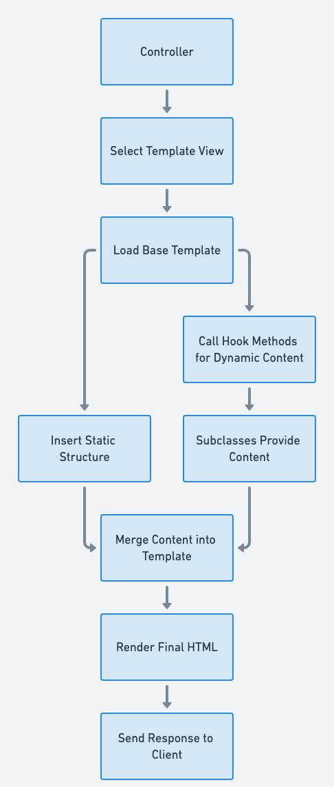

## Intent of Template View Design Pattern

Separate the structure and static parts of a webpage (or view) from its dynamic content. Template View ensures a consistent layout while allowing flexibility for different types of views.

## Detailed Explanation of Template View Pattern with Real-World Examples

Real-World Example

> Think of a blog website where each post page follows the same layout with a header, footer, and main content area. While the header and footer remain consistent, the main content differs for each blog post. The Template View pattern encapsulates the shared layout (header and footer) in a base class while delegating the rendering of the main content to subclasses.

In Plain Words

> The Template View pattern provides a way to define a consistent layout in a base class while letting subclasses implement the specific, dynamic content for different views.

Wikipedia Says

> While not a classic Gang of Four pattern, Template View aligns closely with the Template Method pattern, applied specifically to rendering webpages or views. It defines a skeleton for rendering, delegating dynamic parts to subclasses while keeping the structure consistent.

Flowchart



## Programmatic Example of Template View Pattern in Java

Our example involves rendering different types of views (`HomePageView` and `ContactPageView`) with a common structure consisting of a header, dynamic content, and a footer.

### The Abstract Base Class: TemplateView

The `TemplateView` class defines the skeleton for rendering a view. Subclasses provide implementations for rendering dynamic content.

```java
@Slf4j
public abstract class TemplateView {

  public final void render() {
    printHeader();
    renderDynamicContent();
    printFooter();
  }

  protected void printHeader() {
    LOGGER.info("Rendering header...");
  }

  protected abstract void renderDynamicContent();

  protected void printFooter() {
    LOGGER.info("Rendering footer...");
  }
}
```
### Concrete Class: HomePageView
```java
@Slf4j
public class HomePageView extends TemplateView {

  @Override
  protected void renderDynamicContent() {
    LOGGER.info("Welcome to the Home Page!");
  }
}
```
### Concrete Class: ContactPageView
```java
@Slf4j
public class ContactPageView extends TemplateView {

  @Override
  protected void renderDynamicContent() {
    LOGGER.info("Contact us at: contact@example.com");
  }
}
```
### Application Class: App
The `App` class demonstrates rendering different views using the Template View pattern.
```java
@Slf4j
public class App {

  public static void main(String[] args) {
    TemplateView homePage = new HomePageView();
    LOGGER.info("Rendering HomePage:");
    homePage.render();

    TemplateView contactPage = new ContactPageView();
    LOGGER.info("\nRendering ContactPage:");
    contactPage.render();
  }
}
```
## Output of the Program
```lessRendering HomePage:
Rendering header...
Welcome to the Home Page!
Rendering footer...

Rendering ContactPage:
Rendering header...
Contact us at: contact@example.com
Rendering footer...
```
## When to Use the Template View Pattern in Java
- When you want to enforce a consistent structure for rendering views while allowing flexibility in dynamic content. 
- When you need to separate the static layout (header, footer) from the dynamic parts of a view (main content). 
- To enhance code reusability and reduce duplication in rendering logic.

## Benefits and Trade-offs of Template View Pattern
**Benefits:**
- Code Reusability: Centralizes shared layout logic in the base class.
- Maintainability: Reduces duplication, making updates easier.
- Flexibility: Allows subclasses to customize dynamic content.

**Trade-offs:**
- Increased Number of Classes: Requires creating separate classes for each type of view.
- Design Overhead: Might be overkill for simple applications with few views.

## Related Java Design Patterns
- [Template Method](https://java-design-patterns.com/patterns/template-method/): A similar pattern focusing on defining a skeleton algorithm, allowing subclasses to implement specific steps.
- [Strategy Pattern](https://java-design-patterns.com/patterns/strategy/): Offers flexibility in choosing dynamic behaviors at runtime instead of hardcoding them in subclasses.
- [Decorator Pattern](https://java-design-patterns.com/patterns/decorator/): Can complement Template View for dynamically adding responsibilities to views.

## Real World Applications of Template View Pattern
- Web frameworks like Spring MVC and Django use this concept to render views consistently.
- CMS platforms like WordPress follow this pattern for theme templates, separating layout from content.

## References and Credits
- [Effective Java](https://amzn.to/4cGk2Jz)
- [Head First Design Patterns: Building Extensible and Maintainable Object-Oriented Software](https://amzn.to/49NGldq)
- [Refactoring to Patterns](https://amzn.to/3VOO4F5)
- [Template Method Pattern](https://refactoring.guru/design-patterns/template-method)
- [Basics of Django: Model-View-Template (MVT) Architecture](https://angelogentileiii.medium.com/basics-of-django-model-view-template-mvt-architecture-8585aecffbf6)
